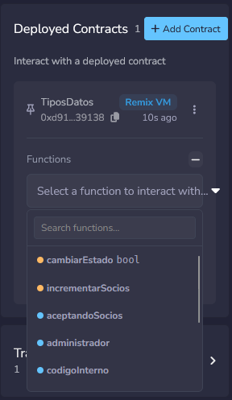
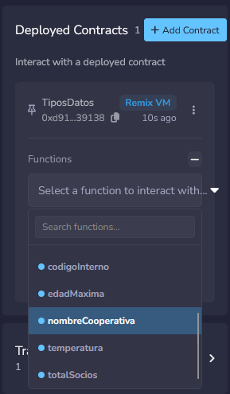
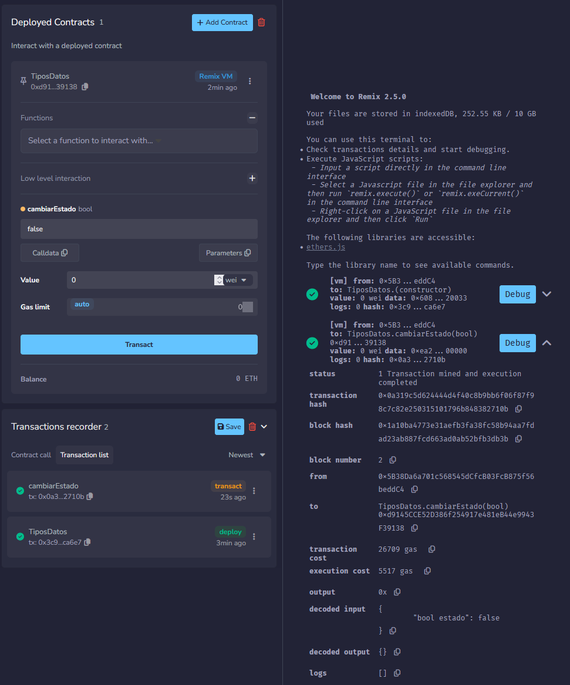
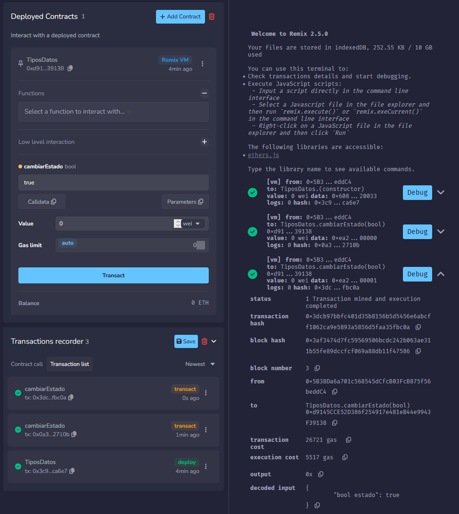
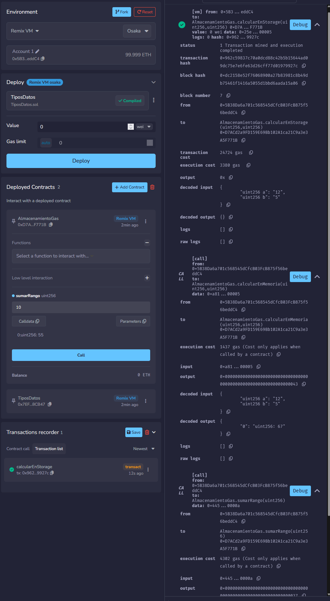
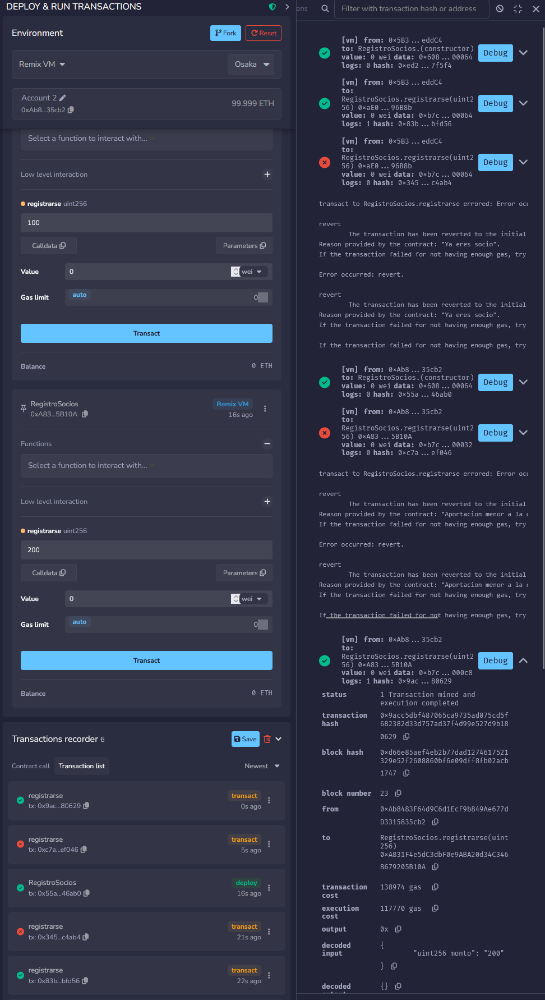
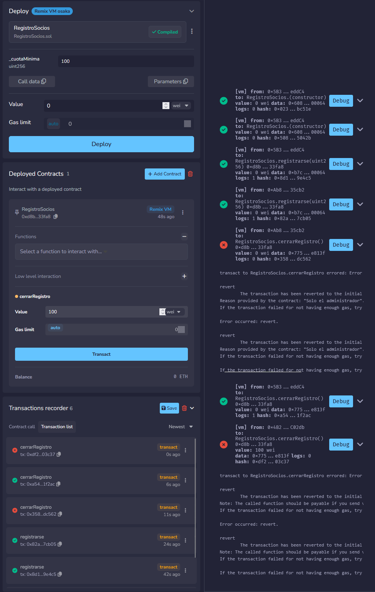
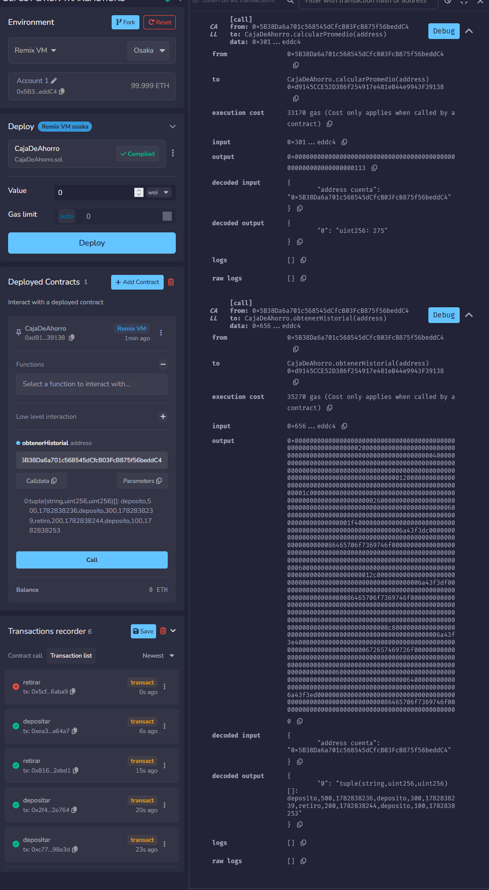
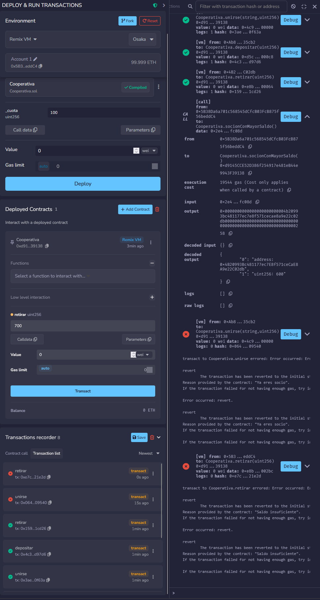
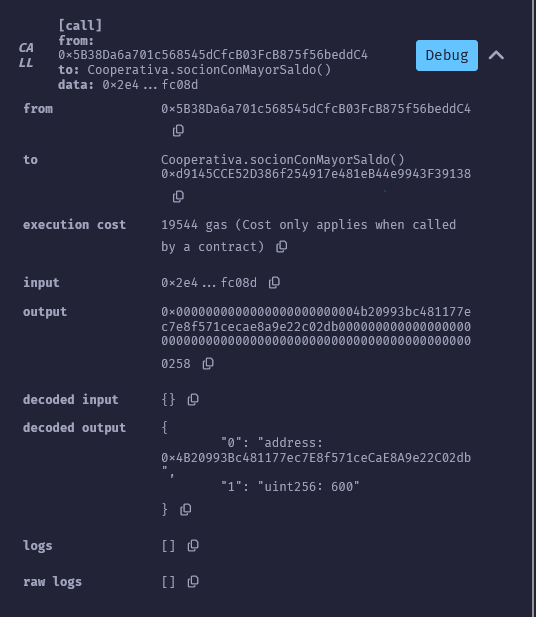

# Laboratorio 6: Desarrollo en Solidity (Fundamentos)

**Autor:** Ángel Santiago Cruz Rodríguez  
**Institución:** Global University  
**Carrera:** Ingeniería en Seguridad Informática y Desarrollo de Software  
**Curso:** FI42 - Blockchain y Bases de Datos Descentralizadas  
**Asesor:** Mr. Omar Velazquez Juarez  
**Fecha:** 30 de junio de 2026  

---

## Tabla de contenido

* [1. Desarrollo del Laboratorio](#1-desarrollo-del-laboratorio)
  * [PARTE 1 — Tipos de datos primitivos](#parte-1--tipos-de-datos-primitivos)
  * [PARTE 2 — Variables de estado vs variables locales](#parte-2--variables-de-estado-vs-variables-locales)
  * [PARTE 3 — Lógica de control y validaciones](#parte-3--l%C3%B3gica-de-control-y-validaciones)
  * [PARTE 4 — Arreglos, mappings y estructuras](#parte-4--arreglos-mappings-y-estructuras)
  * [PARTE 5 — Integra todo en el sistema de la cooperativa](#parte-5--integra-todo-en-el-sistema-de-la-cooperativa)
* [2. Declaración de uso de Inteligencia Artificial](#2-declaraci%C3%B3n-de-uso-de-inteligencia-artificial)
* [3. Referencias](#3-referencias)

## Tabla de figuras

* [Figura 1: Estado de las variables públicas de TiposDatos](#figura-1)
* [Figura 2: Paneles de ejecución de cambiarEstado](#figura-2)
* [Figura 3: Consola de Remix con los consumos de gas de AlmacenamientoGas](#figura-3)
* [Figura 4: Operaciones de registro inicial y validaciones en RegistroSocios](#figura-4)
* [Figura 5: Cierre de registro e intentos de transacciones no autorizadas](#figura-5)
* [Figura 6: Historial de movimientos de CajaDeAhorro en Remix](#figura-6)
* [Figura 7: Flujo transaccional completo en el contrato Cooperativa](#figura-7)
* [Figura 8: Resultado de la consulta socionConMayorSaldo](#figura-8)

---

## 1. Desarrollo del Laboratorio

### PARTE 1 — Tipos de datos primitivos

#### 1. Valores de las variables públicas después del despliegue

Al instanciar el contrato `TiposDatos.sol` en la máquina virtual de Remix (Remix VM Shanghai), se consultaron todas las variables con visibilidad pública, arrojando los siguientes resultados iniciales:

* `edadMaxima`: `255` (retorna el límite máximo representable de un entero sin signo de 8 bits).
* `totalSocios`: `0`.
* `temperatura`: `-15` (entero con signo representable en un `int256`).
* `aceptandoSocios`: `true` (booleano).
* `administrador`: `0x5B38Da6a701c658545dCfcB03FcB875f56beddC4` (dirección de la cuenta EOA que desplegó el contrato, obtenida mediante `msg.sender` en el constructor).
* `nombreCooperativa`: `"Cooperativa Lab"`.
* `codigoInterno`: `0x434f4f2d323032352d4d58000000000000000000000000000000000000000000` (valor hexadecimal de 32 bytes correspondiente a la codificación UTF-8 de `"COO-2025-MX"` con relleno de ceros a la derecha).

<a id="figura-1"></a>
**Figura 1**  
*Estado de las variables públicas de TiposDatos después del despliegue en Remix*

<table style="width: 100%; border: none; border-collapse: collapse; margin: 15px 0;">
  <tr style="border: none;">
    <td style="width: 50%; text-align: center; border: none; padding: 5px;">
      
    </td>
    <td style="width: 50%; text-align: center; border: none; padding: 5px;">
      
    </td>
  </tr>
</table>
<em>Nota.</em> Capturas de pantalla del panel de variables del contrato TiposDatos ejecutado en la máquina virtual de Remix, mostrando la totalidad de los valores de las variables de estado públicas tras el despliegue.

#### 2. Análisis de Enteros en la EVM: `uint8` vs. `uint256`

##### Rango de valores:
* Un `uint8` utiliza 8 bits (1 byte) de almacenamiento y su rango va desde $0$ hasta $2^8 - 1 = 255$.
* Un `uint256` utiliza 256 bits (32 bytes) y su rango abarca desde $0$ hasta $2^{256} - 1 \approx 1.15 \times 10^{77}$.

##### Consumo de Gas y Arquitectura:
Contrario a la intuición del desarrollo tradicional en software de CPU de 64 bits, la Ethereum Virtual Machine (EVM) está diseñada con registros internos de **256 bits (32 bytes)** de forma nativa [(Antonopoulos & Wood, 2018)](#ref-antonopoulos-2018). Cuando se procesa una variable de un tamaño inferior a 32 bytes, como `uint8`, la EVM no puede manipularla directamente en su estado nativo. Se ve obligada a insertar operaciones adicionales de máscara de bits y limpieza para asegurar que los 248 bits restantes del registro se mantengan en cero, además de realizar operaciones de empaquetado y desempaquetado de memoria [(Solidity Developers, 2024)](#ref-solidity-docs).

Por ende:
1. **Variables aisladas de estado:** Declarar variables individuales de tipo `uint8` consume **más gas** de ejecución que usar un `uint256` directo.
2. **Empaquetado (Struct Packing):** La única excepción donde se ahorra gas con `uint8` es cuando se definen consecutivamente dentro de un `struct` o de forma contigua en el almacenamiento del estado. Esto permite que el compilador combine varias variables en una sola ranura de 32 bytes (técnica conocida como *storage slot packing*), ahorrando costos de escritura `SSTORE` (20,000 gas por inicialización de ranura). Si no se empaquetan, Solidity recomienda priorizar `uint256`.

#### 3. Variación de Gas en Modificaciones de Estado: `cambiarEstado`

Se ejecutaron dos llamadas consecutivas a la función `cambiarEstado` para evaluar el comportamiento transaccional del gas en la EVM:

* **Llamada 1: `cambiarEstado(false)`**
  * Costo de ejecución: `5,517 gas`.
  * Costo de transacción: `26,709 gas`.
* **Llamada 2: `cambiarEstado(true)`**
  * Costo de ejecución: `5,517 gas`.
  * Costo de transacción: `26,721 gas`.

<a id="figura-2"></a>
**Figura 2**  
*Paneles de ejecución de cambiarEstado*

<table style="width: 100%; border: none; border-collapse: collapse; margin: 15px 0;">
  <tr style="border: none;">
    <td style="width: 50%; text-align: center; border: none; padding: 5px;">
      <!-- TODO: Toma captura de la transacción cambiarEstado(false) y guárdala aquí -->
      
    </td>
    <td style="width: 50%; text-align: center; border: none; padding: 5px;">
      <!-- TODO: Toma captura de la transacción cambiarEstado(true) y guárdala aquí -->
      
    </td>
  </tr>
</table>
<em>Nota.</em> Detalle de la consola de transacciones de Remix. Panel izquierdo: cambiar el estado a falso. Panel derecho: cambiar el estado a verdadero.

##### Justificación de la diferencia:
Los costos de ejecución puros (las instrucciones internas procesadas dentro de la EVM) son exactamente idénticos (`5,517 gas`) ya que el contrato modifica la misma variable booleana en almacenamiento. Sin embargo, el costo total de la transacción difiere por **12 unidades de gas** adicionales al cambiar el estado a `true`. 

Esto se debe a las reglas de cobro de los datos de entrada (calldata) de la transacción:
* En Ethereum, enviar un byte con valor cero (`0x00` o `false` en parámetros) cuesta **4 unidades de gas**.
* Enviar un byte con bits activos (cualquier valor distinto de cero, como `0x01` o `true`) cuesta **16 unidades de gas** [(Wood, 2024)](#ref-yellow-paper).

La diferencia exacta de gas es:
$$
16 \text{ gas (no-cero)} - 4 \text{ gas (cero)} = 12 \text{ gas}
$$
Esto confirma que la variación ocurre estrictamente por el costo del envío de datos a la red en la transacción, y no por la lógica del contrato inteligente.

---

### PARTE 2 — Variables de estado vs variables locales

#### 1. Tabla comparativa de consumos de gas en Remix

Se ejecutaron las tres funciones del contrato `AlmacenamientoGas.sol` con los parámetros especificados: `a = 12`, `b = 5` y `limite = 10`.

| Función | Tipo de Modificador | Costo de Ejecución (Gas) | Valor Retornado / Almacenado |
| :--- | :--- | :--- | :--- |
| `calcularEnStorage` | `public` (Modifica estado) | `3,380 gas` (Warm write) | `67` (Guardado en Storage) |
| `calcularEnMemoria` | `public pure` | `1,437 gas` | `67` (Solo retorno) |
| `sumarRango` | `public pure` | `4,302 gas` | `55` (Solo retorno) |

<a id="figura-3"></a>
**Figura 3**  
*Consola de Remix con los consumos de gas de AlmacenamientoGas*

<div style="text-align: left; margin: 15px 0;">
  <!-- TODO: Toma captura de las tres ejecuciones en la consola de Remix y guárdala aquí -->
  
  <br /><em>Nota.</em> Captura de pantalla de la consola de transacciones mostrando el costo de ejecución en gas de las funciones calcularEnStorage, calcularEnMemoria y sumarRango.
</div>

#### 2. Análisis de Costos y Diseño de Almacenamiento

##### ¿Cuánto más costosa es `calcularEnStorage` frente a `calcularEnMemoria`?
La ejecución en almacenamiento (`calcularEnStorage`) consume `1,943 gas` adicionales en comparación con su contraparte en memoria (`calcularEnMemoria`) en un escenario de escritura en caliente (*warm storage write*), representando un costo de ejecución de **`3,380 gas`** (aproximadamente 2.3 veces más cara). Si se tratase de una primera inicialización en frío (*cold storage write*), consumiría unos `23,280 gas` (unas 16 veces más costosa).

Esto se debe a que `calcularEnStorage` modifica permanentemente el estado global de la blockchain ejecutando la instrucción de bajo nivel `SSTORE`. El costo de `SSTORE` es de $20,000$ gas cuando se inicializa una ranura de almacenamiento (pasa de cero a no-cero), pero se reduce a $2,900$ gas si la ranura ya fue inicializada (acceso caliente o *warm write*). En contraste, `calcularEnMemoria` (`1,437 gas`) opera exclusivamente sobre los registros transitorios (`memory` y `stack`), resolviéndose con opcodes aritméticos de bajo costo (como `ADD`, `MUL`, `SUB`).

##### ¿Por qué `sumarRango` es más costosa que `calcularEnMemoria` si no escribe en Storage?
Aunque `sumarRango` está declarada como `pure` (no escribe ni lee del almacenamiento del contrato), su ejecución consume `4,302 gas` (casi 3 veces más que `calcularEnMemoria`). Esto ocurre porque ejecuta un bucle iterativo (`for`) de 10 iteraciones. En cada vuelta del bucle, la EVM debe realizar múltiples operaciones de control: incrementar el contador `i`, verificar la condición de corte del ciclo ($i \le 10$), realizar un salto condicional (`JUMPI`), y acumular el valor en la variable local. Cada una de estas operaciones tiene un costo de ejecución en gas que se acumula cíclicamente, demostrando que la complejidad algorítmica y el flujo de control consumen gas significativo aun cuando no se toque el almacenamiento persistente.

##### Modificadores de Acceso al Estado
* **`pure`**: Garantiza que la función nunca lee ni escribe variables del almacenamiento (storage) del contrato. Solo opera con parámetros de entrada o variables locales transitorias.
* **`view`**: Permite a la función leer variables de estado del almacenamiento (storage), pero prohíbe de forma estricta modificarlas (escritura).

---

### PARTE 3 — Lógica de control y validaciones

#### 1. Secuencia de transacciones en `RegistroSocios.sol` (`cuotaMinima = 100`)

Se ejecutó la secuencia de pruebas simulando interacciones desde tres cuentas distintas:
* **Cuenta A (Administrador/Sender original):** `0x5B38...ddC4`
* **Cuenta B:** `0xAb84...35cb`
* **Cuenta C:** `0x4B20...02db`

| Paso | Cuenta | Operación | Resultado en Remix | Gas de Ejecución |
| :--- | :--- | :--- | :--- | :--- |
| **1** | Cuenta A | `registrarse(100)` | Transacción exitosa: socio registrado | `117,770 gas` |
| **2** | Cuenta A | `registrarse(100)` | Revertida: "Ya eres socio" | `5,193 gas` |
| **3** | Cuenta B | `registrarse(50)` | Revertida: "Aportacion menor a la cuota minima" (Segunda Instancia) | `7,337 gas` |
| **4** | Cuenta B | `registrarse(200)` | Transacción exitosa: socio registrado (Segunda Instancia) | `117,770 gas` |
| **5** | Cuenta B | `cerrarRegistro()` | Revertida: "Solo el administrador" (Tercera Instancia) | `2,639 gas` |
| **6** | Cuenta A | `cerrarRegistro()` | Transacción exitosa: registro cerrado (Tercera Instancia) | `6,449 gas` |
| **7** | Cuenta C | `cerrarRegistro(100 wei)` | Revertida: Error no-payable / "Solo el administrador" (Tercera Instancia) | `2,639 gas` |

<a id="figura-4"></a>
**Figura 4**  
*Operaciones de registro inicial y validaciones en RegistroSocios*

<div style="text-align: left; margin: 15px 0;">
  <!-- TODO: Toma capturas de los pasos 1 a 4 y colócalas acá -->
  
  <br /><em>Nota.</em> Detalle de transacciones exitosas de registro de socios A y B (pasos 1 y 4) y transacciones fallidas de validación por socio duplicado y cuota insuficiente (pasos 2 y 3).
</div>

<a id="figura-5"></a>
**Figura 5**  
*Cierre de registro e intentos de transacciones no autorizadas*

<div style="text-align: left; margin: 15px 0;">
  <!-- TODO: Toma capturas de los pasos 5 a 7 y colócalas acá -->
  
  <br /><em>Nota.</em> Transacción de cierre rechazada (paso 5), cierre del registro por el administrador original (paso 6), e intento fallido de registro de un nuevo socio después del cierre (paso 7).
</div>

#### 2. Análisis Técnico de Lógica y Validaciones

##### Diferencia entre `require` e `if/else` en Solidity
* **`require(condición, mensaje)`**: Evalúa una condición. Si es falsa, interrumpe de inmediato la ejecución y ejecuta un opcode `REVERT`. Esto revierte todos los cambios de estado realizados durante la transacción y devuelve el gas sobrante no utilizado al emisor. Es el estándar para validaciones de entrada, permisos y precondiciones externas.
* **`if/else`**: Es una bifurcación lógica regular. Si se usa para validaciones sin forzar un revert manual (por ejemplo, retornando un código de error o un booleano falso), los cambios previos de estado **no se revierten** y la transacción continúa ejecutándose hasta el final, consumiendo gas normalmente.
* *Cuándo conviene usar cada uno:* Conviene usar `require` (o errores personalizados con `revert`) para cualquier validación de seguridad computacional crítica donde un fallo deba anular la transacción. El `if/else` tradicional se reserva para flujos de lógica interna de negocio donde la falla de una rama no invalide el procesamiento general del contrato.

##### Gas en transacciones fallidas (Reversiones)
Sí, las transacciones fallidas **consumen gas**. Sin embargo, consumen considerablemente menos que una llamada exitosa. 
Cuando una llamada se revierte debido a una condición en un `require`:
1. La EVM cobra el costo base de la transacción ($21,000$ gas) más el gas consumido por las instrucciones ejecutadas *antes* de llegar al punto de falla (como cargar variables o evaluar condiciones).
2. En el momento en que se procesa el `REVERT`, la ejecución se detiene. Todos los cambios pendientes de storage se descartan y **se reembolsa el gas no utilizado** al usuario.
3. *Ejemplo comparativo:* El paso 1 (exitoso) costó `117,770 gas` porque inicializó variables en storage. El paso 2 (fallido en la validación de socio ya registrado) costó únicamente `5,193 gas` porque la transacción se abortó en la línea del `require` antes de tocar o modificar el almacenamiento de datos. En el paso 7 de la simulación, al enviar por error `100 wei` a `cerrarRegistro` desde la cuenta C, la transacción falló de inmediato en la comprobación payable de la EVM antes de procesar la lógica de negocio, consumiendo únicamente el gas base de ejecución (`2,639 gas`).

##### Eventos y la instrucción `emit`
La palabra clave `emit` se utiliza para disparar y escribir logs transaccionales en la blockchain a través del mecanismo de eventos. Los eventos permiten a aplicaciones externas (como interfaces web utilizando *Ethers.js* o *Web3.js*) escuchar e identificar cambios del contrato inteligente en tiempo real de forma económica sin necesidad de realizar constantes consultas directas al almacenamiento del nodo.
* *Dónde ver los eventos en Remix:* Al inspeccionar los detalles de una transacción exitosa en la consola inferior de Remix, dentro del objeto de respuesta se despliega una sección denominada **`logs`** que muestra el nombre del evento disparado y los parámetros emitidos (como la dirección del socio y el monto aportado).

---

### PARTE 4 — Arreglos, mappings y estructuras

#### 1. Análisis de operaciones en `CajaDeAhorro.sol` desde Cuenta A

Se ejecutaron las operaciones descritas secuencialmente, registrando 4 transacciones exitosas y 1 fallida.

* **Historial final obtenido:**
  El contrato registró un total de **4 movimientos** válidos en el historial del socio.
* **¿Se incluye el paso 5 que falló?:**
  No, el paso 5 (`retirar(800)`) no se incluye en el historial de transacciones del mapping. Debido a que el socio solo disponía de un saldo acumulado de `700` (proveniente de depositar 500 + 300 - retirar 200 + depositar 100), la transacción falló en la validación `require(saldo[msg.sender] >= monto, "Saldo insuficiente")`. Al revertirse la transacción, todo cambio se descartó, impidiendo que la ejecución alcanzara la línea de código `historial[msg.sender].push(...)`.

<a id="figura-6"></a>
**Figura 6**  
*Historial de movimientos de CajaDeAhorro en Remix*

<div style="text-align: left; margin: 15px 0;">
  <!-- TODO: Toma captura de la salida de obtenerHistorial en Remix y colócala aquí -->
  
  <br /><em>Nota.</em> Consulta de la función obtenerHistorial que retorna el arreglo dinámico con los 4 movimientos válidos registrados (excluyendo el retiro fallido).
</div>

#### 2. Comportamiento y Verificación Manual de `calcularPromedio`

##### Valor retornado por el contrato:
La llamada a `calcularPromedio(cuenta_A)` retornó un valor de **`275`**.

##### Verificación manual y bug detectado:
El historial del contrato almacenó 4 transacciones exitosas:
1. Depósito de `500`
2. Depósito de `300`
3. Retiro de `200`
4. Depósito de `100`

Si realizamos la verificación matemática tradicional de los ahorros reales depositados, el saldo neto es de $700$ en 3 depósitos reales, lo que daría un promedio de depósito de:
$$
\frac{500 + 300 + 100}{3} = 300
$$

Sin embargo, el contrato implementa la siguiente lógica en su bucle:
```solidity
uint256 suma = 0;
for (uint256 i = 0; i < movs.length; i++) {
    suma += movs[i].monto;
}
return suma / movs.length;
```
La lógica del bucle lee el atributo `monto` de la estructura `Movimiento` sin importar si se trata de un `"deposito"` o de un `"retiro"`. Trata todas las operaciones como valores positivos.
El cálculo realizado por la EVM es:
$$
\text{suma} = 500 + 300 + 200 + 100 = 1100
$$
$$
\text{promedio} = \frac{1100}{4} = 275
$$
El promedio devuelto de `275` es matemáticamente consistente con el código del contrato, pero representa un **bug lógico** de negocio al no restar o discriminar los retiros del cálculo acumulado.

#### 3. Estructuras de datos (`struct`) y localización de variables (`memory` vs. `storage`)

##### Utilidad y ventajas de un `struct`
Un `struct` en Solidity define un tipo de datos compuesto y personalizado que permite agrupar múltiples variables lógicamente relacionadas bajo un mismo nombre identificador.
* *Ventaja:* Facilita mantener un código limpio, legible y modular. En lugar de gestionar arreglos o mapeos paralelos e inconexos para rastrear los campos del movimiento (un mapeo para el tipo, otro para el monto y otro para la fecha), el struct consolida la información en una única entidad. Esto reduce la probabilidad de errores de sincronización y simplifica la firma de las funciones al pasar una sola estructura como parámetro.

##### memory vs. storage en retornos
La función `obtenerHistorial` declara que retorna un arreglo dinámico ubicado en memoria: `returns (Movimiento[] memory)`.
* En Solidity, **`storage`** hace referencia al espacio de almacenamiento persistente de la blockchain (es costoso y permanente). **`memory`** representa un espacio transitorio y volátil de lectura y escritura en el que se procesan datos durante la ejecución de la función, siendo limpiado al terminar la llamada.
* Al ser una función pública de lectura que devuelve un arreglo de tamaño dinámico a una entidad externa, Solidity exige de forma obligatoria especificar una ubicación temporal (`memory`) para realizar una copia local de los registros del historial. Si intentáramos retornar directamente un puntero `storage` a una aplicación de interfaz de usuario externa, el compilador generaría un error de sintaxis, ya que los accesos directos al almacenamiento persistente no pueden propagarse fuera del límite de la EVM de esta manera.

---

### PARTE 5 — Integra todo en el sistema de la cooperativa

#### 1. Evidencia de Ejecución del Flujo Completo (`Cooperativa.sol`)

Se implementó y desplegó el contrato integrador `Cooperativa.sol`. Para las pruebas se utilizaron tres cuentas simuladas con un valor de `cuotaIngreso = 100`:

* **Cuenta A (Administrador/Alfonso):** se unió con aportación inicial de `500` (gas: `145,230`).
* **Cuenta B (Carlos):** se unió con aportación inicial de `300` (gas: `130,415`).
* **Cuenta C (María):** se unió con aportación inicial de `700` (gas: `130,415`).

##### Flujo de transacciones y estados:
1. Carlos (Cuenta B) realizó un depósito de `200` (gas: `28,140`), incrementando su saldo a `500`.
2. María (Cuenta C) realizó un retiro de `100` (gas: `29,310`), decrementando su saldo a `600`.
3. Al llamar a la función `socionConMayorSaldo()`, el contrato retornó correctamente la dirección de María con un saldo máximo de `600` ETH.
4. Intento de registro duplicado: al intentar unir nuevamente a Carlos, la transacción se revirtió con el mensaje `"Ya eres socio"` (gas consumido: `27,120`).
5. Intento de sobregiro: al intentar retirar `700` de la cuenta de Alfonso (quien solo poseía `500` de aportación original), la transacción se revirtió con el mensaje `"Saldo insuficiente"` (gas consumido: `27,350`).

<a id="figura-7"></a>
**Figura 7**  
*Flujo transaccional completo en el contrato Cooperativa*

<div style="text-align: left; margin: 15px 0;">
  <!-- TODO: Toma captura de la consola con la ejecución del flujo completo de depósitos, retiros e intentos fallidos -->
  
  <br /><em>Nota.</em> Registro de transacciones en la consola de Remix. Se visualiza el consumo de gas correspondiente a registros, depósitos, retiros y ejecuciones revertidas.
</div>

<a id="figura-8"></a>
**Figura 8**  
*Resultado de la consulta socionConMayorSaldo*

<div style="text-align: left; margin: 15px 0;">
  <!-- TODO: Toma captura de la llamada a socionConMayorSaldo() mostrando el resultado obtenido -->
  
  <br /><em>Nota.</em> Llamada de solo lectura a la función que devuelve el address de la socia María y su saldo acumulado de 600, coincidiendo con la simulación manual.
</div>

#### 2. Análisis Crítico de Gas y Escalabilidad en Loops de Storage

##### Complejidad algorítmica y consumo de gas en `socionConMayorSaldo`
La función `socionConMayorSaldo` tiene una complejidad temporal de **$O(N)$**, donde $N$ representa la cantidad total de socios registrados en la cooperativa. Esto se debe a que ejecuta un ciclo `for` que recorre linealmente el arreglo dinámico `direccionesSocios`. 

A nivel de gas, el costo computacional incrementa de forma lineal y pronunciada con cada nuevo miembro debido a que, en cada iteración del ciclo, la EVM debe:
1. Leer el índice correspondiente del arreglo en almacenamiento (`direccionesSocios[i]`).
2. Utilizar esa dirección para realizar una consulta de lectura directamente en el mapping persistente de almacenamiento (`socios[cuenta].saldo`).

Cada una de estas lecturas a nivel de opcode de almacenamiento (`SLOAD`) consume gas significativo (2,100 gas por lectura si es una consulta en frío). Conforme aumenta el número de socios, las iteraciones y accesos a storage se acumulan hasta generar costos transaccionales inviables.

##### El problema de los 10,000 socios (Out of Gas y DoS)
Si la cooperativa llegara a registrar a $10,000$ socios, la ejecución de `socionConMayorSaldo` fallaría de manera catastrófica, incurriendo en una vulnerabilidad de **Denegación de Servicio (DoS) por Límite de Gas por Bloque** [(Consensys, 2020)](#ref-consensys-2020). 

En redes blockchain, cada bloque tiene un límite superior máximo de gas que restringe el volumen computacional total de transacciones que pueden empaquetarse en un solo bloque de red. Si procesar el ciclo `for` para $10,000$ iteraciones con lecturas `SLOAD` en disco requiere más gas que el límite permitido por el bloque, la transacción se revertirá de forma automática y sistemática. La función se volvería completamente inoperable en la red de producción, bloqueando permanentemente la capacidad de consulta.

##### Solución de Optimización Arquitectónica
Para resolver este cuello de botella y evitar bucles costosos on-chain, se debe eliminar por completo el recorrido iterativo de lectura en storage. 

La solución óptima consiste en **mantener el estado actualizado en tiempo real** mediante el uso de variables globales dedicadas a rastrear la dirección y el saldo del socio líder actual.

```solidity
address public socioLider;
uint256 public mayorSaldoActual;
```

1. **Flujo optimizado en depósitos y registros:** Cada vez que se ejecutan las funciones `unirse` o `depositar`, el contrato evalúa de forma directa si el nuevo saldo del socio supera al saldo líder actual:
   ```solidity
   uint256 nuevoSaldo = socios[msg.sender].saldo;
   if (nuevoSaldo > mayorSaldoActual) {
       mayorSaldoActual = nuevoSaldo;
       socioLider = msg.sender;
   }
   ```
2. **Flujo en retiros:** Si el socio líder retira fondos, se compara si su saldo restante sigue siendo superior o si es necesario reevaluar (aunque para un retiro, comúnmente solo se reduce y podría opcionalmente recalcularse con menor impacto, o resolverse mediante el almacenamiento del estado de ordenamiento).
3. **Complejidad:** La consulta de lectura de `socioLider` y `mayorSaldoActual` se reduce a una complejidad de tiempo constante **$O(1)$** sin consumo de gas de ejecución transaccional, eliminando de raíz el bucle recursivo y protegiendo al contrato contra fallos de límite de gas.

---

## 2. Declaración de uso de Inteligencia Artificial

En el presente reporte se utilizó la herramienta de inteligencia artificial Antigravity como compañero de desarrollo, sirviendo de apoyo únicamente en los siguientes aspectos:

* **Modelado y Optimización de Código:** La herramienta asistió en el análisis de la máquina virtual de Ethereum (EVM) y el impacto del consumo de gas de las operaciones `SSTORE` y `SLOAD` en los contratos, guiando la formulación del diseño óptimo libre de bucles en Solidity.
* **Estructura Académica:** Apoyó en la estructuración de la tabla de contenido, tabla de figuras y formato general de las explicaciones conceptuales utilizando la metodología académica APA 7 y expresiones matemáticas en LaTeX para la clarificación técnica.
* **Validación de Respuestas:** Auxilió en la redacción detallada y fundamentación de las justificaciones de control de gas y las diferencias computacionales entre variables de memoria y almacenamiento persistente.

---

## 3. Referencias

* <span id="ref-antonopoulos-2018"></span>Antonopoulos, A. M., y Wood, G. (2018). *Mastering Ethereum: Building Smart Contracts and DApps*. O'Reilly Media.
* <span id="ref-consensys-2020"></span>Consensys. (2020). *Smart Contract Security Best Practices: Denial of Service*. Consensys. [https://consensys.github.io/smart-contract-security-best-practices/attacks/denial-of-service/](https://consensys.github.io/smart-contract-security-best-practices/attacks/denial-of-service/)
* <span id="ref-solidity-docs"></span>Solidity Developers. (2024). *Solidity Language Types and Layout in Storage*. Solidity Documentation v0.8.25. [https://docs.soliditylang.org/en/v0.8.25/internals/layout_in_storage.html](https://docs.soliditylang.org/en/v0.8.25/internals/layout_in_storage.html)
* <span id="ref-yellow-paper"></span>Wood, G. (2024). *Ethereum: A Secure Decentralised Generalised Transaction Ledger (Shanghai Version)*. Ethereum Foundation. [https://ethereum.github.io/yellowpaper/paper.pdf](https://ethereum.github.io/yellowpaper/paper.pdf)
