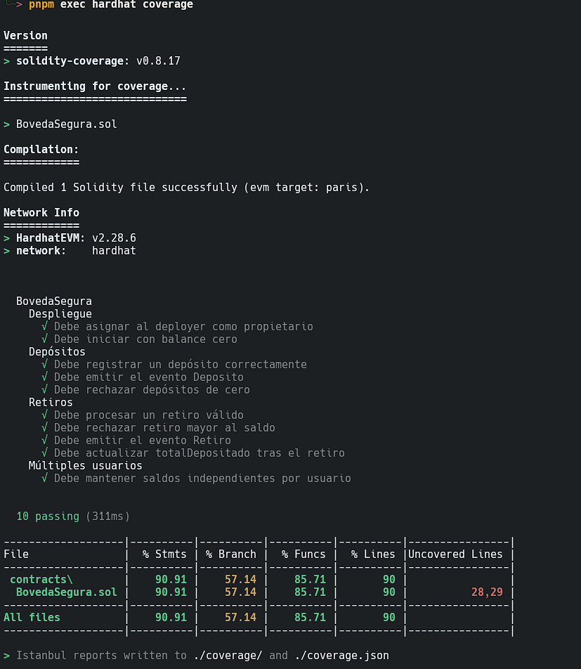
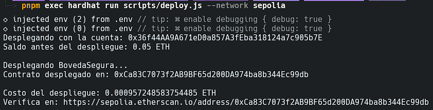
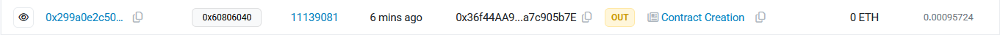
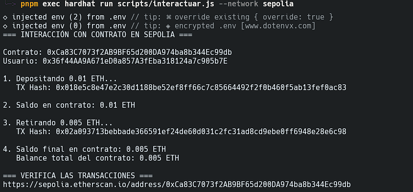
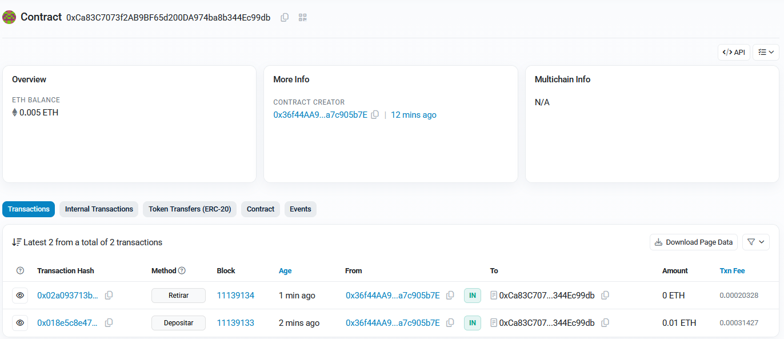

# Laboratorio 7: Desarrollo en Solidity Avanzado - Despliegue Profesional con Hardhat

**Autor:** Ángel Santiago Cruz Rodríguez
**Institución:** Global University
**Carrera:** Ingeniería en Seguridad Informática y Desarrollo de Software
**Curso:** FI42 - Blockchain y Bases de Datos Descentralizadas
**Asesor:** Mr. Omar Velazquez Juarez
**Fecha:** 26 de junio de 2026

## Tabla de contenido

* [1. Desarrollo del Laboratorio](#1-desarrollo-del-laboratorio)
  * [PARTE 1 — Configuración del Entorno y Preparación](#parte-1--configuraci%C3%B3n-del-entorno-y-preparaci%C3%B3n)
  * [PARTE 2 — Desarrollo y Compilación](#parte-2--desarrollo-y-compilaci%C3%B3n)
  * [PARTE 3 — Pruebas Automatizadas](#parte-3--pruebas-automatizadas)
  * [PARTE 4 — Configuración del Despliegue a Sepolia](#parte-4--configuraci%C3%B3n-del-despliegue-a-sepolia)
  * [PARTE 5 — Despliegue en Sepolia](#parte-5--despliegue-en-sepolia)
  * [PARTE 6 — Interacción con el Contrato Desplegado](#parte-6--interacci%C3%B3n-con-el-contrato-desplegado)
  * [PARTE 7 — Seguridad: Demostración de Reentrancy Attack](#parte-7--seguridad-demostraci%C3%B3n-de-reentrancy-attack)
  * [PARTE 8 — Reflexión final](#parte-8--reflexi%C3%B3n-final)
* [2. Declaración de uso de Inteligencia Artificial](#2-declaraci%C3%B3n-de-uso-de-inteligencia-artificial)
* [3. Referencias](#3-referencias)

## Tabla de figuras

* [Fig. 1: Verificación del entorno de desarrollo](#fig-1)
* [Fig. 2a: Modo desarrollador](#fig-2a)
* [Fig. 2b: Redes de prueba](#fig-2b)
* [Fig. 2c: Dirección pública EOA](#fig-2c)
* [Fig. 3a: Reclamación en Faucet](#fig-3a)
* [Fig. 3b: Saldo reflejado en MetaMask](#fig-3b)
* [Fig. 4: Estructura del proyecto en terminal](#fig-4)
* [Fig. 5a: Estructura de archivos](#fig-5a)
* [Fig. 5b: Salida del compilador](#fig-5b)
* [Fig. 6a: Ejecución de pruebas](#fig-6a)
* [Fig. 6b: Reporte de gas](#fig-6b)
* [Fig. 7: Reporte de cobertura de código](#fig-7)
* [Fig. 8: Consulta de saldo en Sepolia](#fig-8)
* [Fig. 9a: Despliegue de BovedaSegura](#fig-9a)
* [Fig. 9b: Detalles del contrato en Etherscan](#fig-9b)
* [Fig. 10a: Pestaña de contrato](#fig-10a)
* [Fig. 10b: Código verificado](#fig-10b)
* [Fig. 11: Script de interacción con BovedaSegura](#fig-11)
* [Fig. 12a: Transacción de depósito](#fig-12a)
* [Fig. 12b: Transacción de retiro](#fig-12b)
* [Fig. 12c: Estado transaccional](#fig-12c)
* [Fig. 13a: Compilación de contratos de reentrada](#fig-13a)
* [Fig. 13b: Simulación local de reentrada](#fig-13b)

---

## 1. Desarrollo del Laboratorio

### PARTE 1 — Configuración del Entorno y Preparación

#### 1. Versiones del Entorno de Desarrollo

* **Node.js:** `v22.17.0`
* **pnpm:** `11.17.0`

<div style="text-align: left; margin: 15px 0;">
  
  <br /><sub><a id="fig-1"></a><strong>Fig. 1:</strong> Verificación del entorno de desarrollo</sub>
</div>

#### 2. Preparación de Cuentas y MetaMask

Se activó el modo de desarrollador y las redes de prueba en la billetera MetaMask, registrando la dirección pública de desarrollo.

<table style="width: 100%; border: none; border-collapse: collapse;">
  <tr style="border: none;">
    <td style="width: 33%; text-align: center; border: none; padding: 5px;">
      
      <br /><sub><a id="fig-2a"></a><strong>Fig. 2a:</strong> Modo desarrollador</sub>
    </td>
    <td style="width: 33%; text-align: center; border: none; padding: 5px;">
      
      <br /><sub><a id="fig-2b"></a><strong>Fig. 2b:</strong> Redes de prueba</sub>
    </td>
    <td style="width: 33%; text-align: center; border: none; padding: 5px;">
      
      <br /><sub><a id="fig-2c"></a><strong>Fig. 2c:</strong> Dirección pública EOA</sub>
    </td>
  </tr>
</table>

#### 3. Obtención de ETH de prueba en la red Sepolia

Se utilizó un Faucet para fondear la cuenta del desarrollador con ETH de pruebas en la red Sepolia.

<table style="width: 100%; border: none; border-collapse: collapse;">
  <tr style="border: none;">
    <td style="width: 50%; text-align: center; border: none; padding: 5px;">
      
      <br /><sub><a id="fig-3a"></a><strong>Fig. 3a:</strong> Reclamación en Faucet</sub>
    </td>
    <td style="width: 50%; text-align: center; border: none; padding: 5px;">
      
      <br /><sub><a id="fig-3b"></a><strong>Fig. 3b:</strong> Saldo reflejado en MetaMask</sub>
    </td>
  </tr>
</table>

#### 4. Estructura Inicial del Proyecto Hardhat

La inicialización generó la estrucutra inicial del proyecto en la carpeta raíz [dapp-lab/](dapp-lab/):

<div style="text-align: left; margin: 15px 0;">
  
  <br /><sub><a id="fig-4"></a><strong>Fig. 4:</strong> Estructura del proyecto en terminal</sub>
</div>

#### 5. Comparación de Simuladores Locales: Hardhat Network vs. Ganache

**Hardhat Network** es una red local de Ethereum integrada en Hardhat que simula la EVM en memoria durante el ciclo de desarrollo [(Nomic Foundation, 2026)](#ref-nomic-2026).

##### Diferencias clave:

* **Integración:** Hardhat Network se levanta automáticamente desde la consola con el compilador. Ganache requiere ejecutar un cliente de consola independiente (`ganache-cli`) o una interfaz gráfica de usuario [(Consensys, 2023)](#ref-consensys-2023).
* **Depuración:** Hardhat ofrece logs nativos (`console.log`) directamente en Solidity y stack traces detallados que muestran la línea de código exacta del fallo. Ganache no cuenta con depuración a nivel de contrato [(Nomic Foundation, 2026)](#ref-nomic-2026).
* **Mantenimiento:** Ganache fue descontinuado oficialmente por Consensys en diciembre de 2023, mientras que Hardhat es el estándar de desarrollo activo y mantenido por la Nomic Foundation [(Consensys, 2023)](#ref-consensys-2023).

##### Ventajas de Hardhat Network para el desarrollo:

Las ventajas principales son el **Mainnet Forking** (bifurcación de red), que simula el estado real de Ethereum principal localmente sin costo [(Antonopoulos &amp; Wood, 2018)](#ref-antonopoulos-2018), la depuración directa con `console.log` dentro de Solidity, y los stack traces precisos de transacciones revertidas.

#### 6. Utilidad de `dotenv` en el Contexto de Despliegue

La biblioteca `dotenv` carga variables de entorno desde un archivo [dapp-lab/.env](dapp-lab/.env) local hacia el objeto global `process.env` de Node.js en tiempo de ejecución. En el despliegue de contratos inteligentes, esto resulta de vital importancia por dos razones:

1. **Seguridad (Cuidado de Credenciales):** Permite mantener credenciales críticas y altamente sensibles fuera del código fuente del proyecto, impidiendo que sean subidas por error a repositorios públicos como GitHub.
2. **Modularidad:** Facilita cambiar de red de despliegue (por ejemplo, de Sepolia a Mainnet) modificando simplemente los valores del archivo `.env` local sin tener que alterar la lógica del archivo de configuración [hardhat.config.cjs](dapp-lab/hardhat.config.cjs).

---

### PARTE 2 — Desarrollo y Compilación

#### 1. ¿Qué versión del compilador de Solidity usó Hardhat?

Hardhat utilizó la versión **`0.8.28`** del compilador de Solidity (`solc`), como se especifica en el archivo de información de compilación en [dapp-lab/artifacts/build-info/](dapp-lab/artifacts/build-info/).

#### 2. ¿Qué archivos generó en la carpeta [dapp-lab/artifacts/](dapp-lab/artifacts/)?

La compilación generó dos directorios principales:

* **[dapp-lab/artifacts/build-info/](dapp-lab/artifacts/build-info/)**: Contiene un archivo JSON con un identificador único (e.g., `5c7ac19afa9f752830008aeb46bc5db0.json`) que almacena la configuración de compilación, las fuentes del contrato y el output del compilador.
* **[dapp-lab/artifacts/contracts/BovedaSegura.sol/](dapp-lab/artifacts/contracts/BovedaSegura.sol/)**: Contiene dos archivos del contrato compilado:
  * [BovedaSegura.json](dapp-lab/artifacts/contracts/BovedaSegura.sol/BovedaSegura.json): Contiene el artefacto principal con la interfaz binaria de la aplicación (ABI), el bytecode del contrato compilado, metadatos y mapeo de funciones.
  * [BovedaSegura.dbg.json](dapp-lab/artifacts/contracts/BovedaSegura.sol/BovedaSegura.dbg.json): Contiene metadatos de depuración que ligan este artefacto con su correspondiente archivo en `build-info`.

#### 3. Primeros 20 caracteres del campo `"bytecode"` de [BovedaSegura.json](dapp-lab/artifacts/contracts/BovedaSegura.sol/BovedaSegura.json)

Los primeros 20 caracteres del bytecode hexadecimal son:
`0x6080604052348015600f`

#### 4. Estructura de Archivos del Proyecto Tras la Compilación

<table style="width: 100%; border: none; border-collapse: collapse;">
  <tr style="border: none;">
    <td style="width: 30%; text-align: center; border: none; padding: 5px;">
      
      <br /><sub><a id="fig-5a"></a><strong>Fig. 5a:</strong> Estructura de archivos</sub>
    </td>
    <td style="width: 70%; text-align: center; border: none; padding: 5px;">
      
      <br /><sub><a id="fig-5b"></a><strong>Fig. 5b:</strong> Salida del compilador</sub>
    </td>
  </tr>
</table>

#### 5. ¿Qué ocurriría si el orden de ejecución fuera Checks-Interactions-Effects? (Ataque de Reentrada)

Si el orden fuera alterado a **Checks-Interactions-Effects** (validaciones, transferencia de fondos y finalmente actualización del balance interno), el contrato sería vulnerable a un **Ataque de Reentrada (Reentrancy)** [(Antonopoulos &amp; Wood, 2018)](#ref-antonopoulos-2018); [(Consensys, 2020)](#ref-consensys-2020).

##### Flujo del ataque:

1. **Víctima vulnerable:** El contrato transfiere el ETH del saldo del usuario mediante `msg.sender.call{value: monto}("")` (Interactions) *antes* de restar dicho monto de su balance interno (Effects).
2. **Contrato Atacante:** Un contrato malicioso con una función fallback `receive() external payable` realiza un depósito inicial y llama a `retirar()`.
3. **Primer Retiro e Interrupción:** El contrato víctima valida el saldo (Checks) e inicia la transferencia de fondos (Interactions).
4. **Secuestro del Control:** Al recibir el ETH, la función `receive()` del atacante se activa automáticamente, interrumpiendo el flujo normal del contrato víctima y llamando recursivamente a `retirar()` de nuevo.
5. **Drenaje Recursivo:** Dado que la línea que resta el saldo (`saldos[msg.sender] -= monto`) nunca llegó a ejecutarse en la víctima, el balance del atacante sigue intacto. La función `retirar()` vuelve a validar el saldo original como válido y transfiere más ETH repetidamente, vaciando el balance de la víctima.

---

### PARTE 3 — Pruebas Automatizadas

#### 1. Resultados de las Pruebas y Reporte de Gas

* **¿Cuántas pruebas pasaron?:** Pasaron un total de **10 pruebas** (todas las definidas en la suite).
* **¿Cuánto tiempo tardó la suite en ejecutarse?:** La suite tardó **813 milisegundos (ms)** en la primera ejecución y **889 milisegundos (ms)** al incluir el reporte de gas.
* **¿Qué red usó Hardhat para ejecutar las pruebas? ¿Fue necesario desplegar en ninguna red externa?:** Hardhat utilizó su red local en memoria, **Hardhat Network** [(Nomic Foundation, 2026)](#ref-nomic-2026). No fue necesario ningún despliegue externo.

<table style="width: 100%; border: none; border-collapse: collapse;">
  <tr style="border: none;">
    <td style="width: 45%; text-align: center; border: none; padding: 5px;">
      
      <br /><sub><a id="fig-6a"></a><strong>Fig. 6a:</strong> Ejecución de pruebas</sub>
    </td>
    <td style="width: 55%; text-align: center; border: none; padding: 5px;">
      
      <br /><sub><a id="fig-6b"></a><strong>Fig. 6b:</strong> Reporte de gas</sub>
    </td>
  </tr>
</table>

* **Costos promedio de gas (`depositar` y `retirar`):**
  * `depositar()`: **65,618 unidades de gas** en promedio (rango de 50,418 a 67,518 gas).
  * `retirar()`: **44,040 unidades de gas** en promedio.
  * *Comparación con Remix y consistencia:* Estos valores son consistentes con los medidos manualmente. El costo de `depositar()` es mayor porque implica realizar la primera escritura en almacenamiento del mapeo `saldos[msg.sender]` y del acumulador `totalDepositado` (lo cual consume 20,000 gas por inicialización de storage), sumado al costo base de transacción de 21,000 gas y la emisión del evento. En `retirar()`, al modificar almacenamiento ya inicializado (que es más barato, *warm storage*) y realizar una transferencia simple de Ether por `call`, el costo es menor.

#### 2. Cobertura de las Pruebas

* **Porcentaje de cobertura de líneas (`Lines`):** **90%**.
* **Porcentaje de cobertura de ramas (`Branches`):** **57.14%**.
* **Líneas del contrato no cubiertas:** Las líneas **28 y 29** de [BovedaSegura.sol](dapp-lab/contracts/BovedaSegura.sol).

<div style="text-align: left; margin: 15px 0;">
  
  <br /><sub><a id="fig-7"></a><strong>Fig. 7:</strong> Reporte de cobertura de código</sub>
</div>

* **Explicación de por qué ocurre esto y su importancia:**
  Las líneas 28 y 29 corresponden a la validación de control de acceso dentro del modificador `soloPropietario` (`require(msg.sender == propietario, "No autorizado");`). Esto ocurre porque el modificador `soloPropietario` está definido en el contrato pero no se aplica en ninguna de las funciones actuales (`depositar` y `retirar` son llamadas externas abiertas). Al no ser invocado por ninguna función, las pruebas unitarias jamás ejecutan esta lógica ni sus ramas.
  Es sumamente crítico cubrir esta lógica antes de desplegar en producción: si en el futuro se añade una función administrativa (como una retirada de emergencia) que dependa de este modificador, y este no fue testeado previamente, podríamos estar introduciendo vulnerabilidades críticas en el control de acceso de la DApp [(Consensys, 2020)](#ref-consensys-2020).

---

### PARTE 4 — Configuración del Despliegue a Sepolia

#### 1. ¿Por qué es crítico que `.env` esté en `.gitignore`?

El archivo `.env` contiene credenciales sensibles en texto plano, como la clave privada de la billetera de despliegue (`PRIVATE_KEY`) y tokens de acceso a APIs de infraestructura RPC (`ALCHEMY_SEPOLIA_URL`). Si este archivo no se incluye en `.gitignore`, Git lo rastreará y se publicará en repositorios remotos (como GitHub). Los atacantes usan bots de escaneo automatizado en tiempo real para detectar claves privadas expuestas; una vez detectadas, los atacantes vacían los fondos de las billeteras asociadas en cuestión de segundos [(GitGuardian, 2023)](#ref-gitguardian-2023).

#### 2. Caso de estudio real de pérdida de fondos por exposición de llaves privadas

Un caso relevante ocurrió en junio de 2023 con el protocolo DeFi **unshETH**. Un desarrollador expuso accidentalmente llaves privadas de implementación en un repositorio público de GitHub. A través de esta filtración de credenciales, un atacante obtuvo acceso administrativo para transferir la propiedad de los contratos inteligentes del protocolo. Como consecuencia directa, el atacante drenó **375,000 USD** de los fondos del pool de liquidez del protocolo antes de que el equipo pudiera reaccionar y pausar los contratos [(Web3 is Going Great, 2023)](#ref-web3-2023).

---

### PARTE 5 — Despliegue en Sepolia

#### 1. Verificación de Saldo

* **Dirección del Deployer:** `0x36f44AA9A671eD0a857A3fEba318124a7c905b7E`
* **Saldo en Sepolia:** `0.05 ETH`

<div style="text-align: left; margin: 15px 0;">
  
  <br /><sub><a id="fig-8"></a><strong>Fig. 8:</strong> Consulta de saldo en Sepolia</sub>
</div>

#### 2. Reporte de Despliegue

* **Dirección del contrato desplegado:** `0xCa83C7073f2AB9BF65d200DA974ba8b344Ec99db`
* **Costo de despliegue:** `0.000957248583754485 ETH`
* **Hash de la transacción de creación:** `0x299a0e2c507875c6a68f72ef128e432a9f9a430b03d8a441b251bcb2acf1bc09`
  * *Obtención:* En Etherscan Sepolia, al buscar la dirección del contrato, se localiza en el historial de transacciones en la parte inferior como la transacción con el método de creación (Contract Creation).

<div style="text-align: left; margin: 15px 0;">
  
  <br /><sub><a id="fig-9a"></a><strong>Fig. 9a:</strong> Despliegue de BovedaSegura</sub>
</div>

<div style="text-align: left; margin: 15px 0;">
  
  <br /><sub><a id="fig-9b"></a><strong>Fig. 9b:</strong> Detalles del contrato en Etherscan</sub>
</div>

#### 3. ¿Qué campo confirma que es una cuenta de contrato y no de propietario (EOA)?

1. **Etiqueta y pestaña "Contract":** Etherscan muestra una pestaña dedicada de **"Contract"** (o **"Code"**) para interactuar con la lógica del contrato. Las cuentas de usuario común (EOA) no tienen código asociado y por ende no muestran esta pestaña.
2. **Bytecode de código ejecutable:** A diferencia de las EOAs, que solo contienen saldo y nonce, la dirección de un contrato contiene el bytecode del código cargado en la EVM [(Nomic Foundation, 2026)](#ref-nomic-2026), lo que permite que sea verificado e inspeccionado.

<table style="width: 100%; border: none; border-collapse: collapse;">
  <tr style="border: none;">
    <td style="width: 70%; text-align: center; border: none; padding: 5px;">
      
      <br /><sub><a id="fig-10a"></a><strong>Fig. 10a:</strong> Pestaña de contrato</sub>
    </td>
    <td style="width: 30%; text-align: center; border: none; padding: 5px;">
      
      <br /><sub><a id="fig-10b"></a><strong>Fig. 10b:</strong> Código verificado</sub>
    </td>
  </tr>
</table>

---

### PARTE 6 — Interacción con el Contrato Desplegado

#### 1. Transacciones y Costos de Interacción

* **Hash de la transacción de depósito (0.01 ETH):** `0x018e5c8e47e2c30d1188be52ef8ff66c7c85664492f2f0b460f5ab13fef0ac83`
* **Hash de la transacción de retiro (0.005 ETH):** `0x02a093713bebbade366591ef24de60d031c2fc31ad8cd9ebe0ff6948e28e6c98`
* **Balance final del contrato:** `0.005 ETH`

<div style="text-align: left; margin: 15px 0;">
  
  <br /><sub><a id="fig-11"></a><strong>Fig. 11:</strong> Script de interacción con BovedaSegura</sub>
</div>

#### 2. Métricas de Etherscan Sepolia para cada Transacción

| Métrica                            | Transacción de Depósito | Transacción de Retiro  |
| :---------------------------------- | :------------------------ | :---------------------- |
| **Estado (Status)**           | Success                   | Success                 |
| **Gas Usado (Gas Used)**      | 67,518                    | 44,040                  |
| **Precio de Gas (Gas Price)** | 4.500610671 Gwei          | 4.614810441 Gwei        |
| **Tarifa Total (Txn Fee)**    | 0.00031427703015291 ETH   | 0.00020328909982164 ETH |

<table style="width: 100%; border: none; border-collapse: collapse;">
  <tr style="border: none;">
    <td style="width: 33%; text-align: center; border: none; padding: 5px;">
      
      <br /><sub><a id="fig-12a"></a><strong>Fig. 12a:</strong> Transacción de depósito</sub>
    </td>
    <td style="width: 33%; text-align: center; border: none; padding: 5px;">
      
      <br /><sub><a id="fig-12b"></a><strong>Fig. 12b:</strong> Transacción de retiro</sub>
    </td>
    <td style="width: 33%; text-align: center; border: none; padding: 5px;">
      
      <br /><sub><a id="fig-12c"></a><strong>Fig. 12c:</strong> Estado transaccional</sub>
    </td>
  </tr>
</table>

#### 3. Análisis de Consumo y Diferencias de Gas

* **Diferencia de Gas:** El depósito (67,518 gas) requirió **23,478 unidades de gas más** que el retiro (44,040 gas), lo que representa un costo aproximado de **53.3% más** en términos de uso de la red.
* **Justificación Arquitectónica:**
  Esta diferencia se debe a la optimización de almacenamiento en la EVM. La función `depositar()` realiza la primera escritura en disco para el mapping `saldos[msg.sender]` que previamente estaba vacío (pasando de `0` a `0.01` ETH). En Solidity, escribir en una ranura de almacenamiento vacía (inicialización de *cold storage*) tiene un costo elevado de **20,000 unidades de gas** por operación de escritura `SSTORE`.
  Por el contrario, la función `retirar()` modifica una ranura de almacenamiento que ya estaba activa y contiene información (pasando de `0.01` a `0.005` ETH). Modificar una ranura existente (escritura en *warm storage*) es significativamente más económico (2,900 gas). A pesar de que `retirar()` incluye una transferencia de fondos externa vía `msg.sender.call` (que consume gas de ejecución por el envío de Ether), la enorme reducción en las tarifas de almacenamiento compensa y hace que el retiro resulte más barato globalmente [(Antonopoulos &amp; Wood, 2018)](#ref-antonopoulos-2018).

---

### PARTE 7 — Seguridad: Demostración de Reentrancy Attack

#### 1. ¿Cuántos ETH logró drenar el atacante en la versión vulnerable?

El atacante logró drenar un total de **5.0 ETH** pertenecientes a la víctima (la cual había depositado 5.0 ETH originalmente). Al sumar su depósito inicial de 1.0 ETH, el contrato del atacante recuperó un total de 6.0 ETH del contrato vulnerable, dejándolo con un balance neto de 0.0 ETH.

#### 2. ¿Cuántas veces se llamó la función `receive()` del atacante durante el ataque?

La función callback `receive()` del atacante se llamó exactamente **6 veces** en total durante el proceso del ataque:

* **Primera llamada:** Ocurre al iniciarse la primera llamada legítima a `retirar()` en el contrato víctima. El contrato víctima ejecuta la transferencia de 1.0 ETH del saldo asignado al atacante, lo que activa el primer disparo del `receive()` en el atacante. Al cumplirse la condición de saldo en la víctima (`5.0 ETH >= 1.0 ETH`), el atacante llama recursivamente a `retirar()`.
* **Llamadas de la segunda a la quinta:** Son ejecuciones recursivas directas causadas por las sucesivas llamadas a `retirar()`. En cada ejecución de `receive()`, se valida si el balance remanente de la víctima es suficiente (`4.0 ETH`, `3.0 ETH`, `2.0 ETH`, `1.0 ETH` sucesivamente) y se vuelve a reentrar.
* **Sexta llamada:** Se activa al enviarse el último 1.0 ETH de la víctima. Cuando la ejecución de `receive()` inicia por sexta vez, la condición `address(objetivo).balance >= msg.value` evalúa a `0.0 ETH >= 1.0 ETH`, lo cual es falso. Esto rompe el ciclo recursivo, finalizando el ataque y permitiendo que se desapile el call stack de Solidity para ejecutar la actualización tardía de los estados (`saldos[msg.sender] = 0`).

#### 3. ¿Qué línea específica del modificador `sinReentrada` bloqueó el ataque en `BovedaSegura`?

El ataque fue interceptado y bloqueado en la línea **21** del contrato `BovedaSegura.sol` (dentro del modificador `sinReentrada`):

```solidity
require(!bloqueado, "Reentrancy detectado");
```

**Justificación:** Cuando el contrato atacante intentó realizar la primera llamada recursiva a `retirar()` desde su función `receive()`, la variable de estado `bloqueado` aún almacenaba el valor `true` (establecido en la línea 22 durante la llamada inicial de entrada). Al evaluar la condición del `require`, Solidity revirtió toda la transacción, previniendo el vaciado de los fondos.

<table style="width: 100%; border: none; border-collapse: collapse;">
  <tr style="border: none;">
    <td style="width: 50%; text-align: center; border: none; padding: 5px;">
      
      <br /><sub><a id="fig-13a"></a><strong>Fig. 13a:</strong> Compilación de contratos de reentrada</sub>
    </td>
    <td style="width: 50%; text-align: center; border: none; padding: 5px;">
      
      <br /><sub><a id="fig-13b"></a><strong>Fig. 13b:</strong> Simulación local de reentrada</sub>
    </td>
  </tr>
</table>

---

### PARTE 8 — Reflexión final

#### 1. Costo de transacción en Mainnet y viabilidad para usuarios minoristas

Tomando como base los datos obtenidos en las pruebas unitarias (Parte 3) y la interacción real en la red de pruebas Sepolia (Parte 6), la función `retirar()` de `BovedaSegura` consume un promedio de **44,040 unidades de gas**.

Si calculamos el costo de esta transacción en la red principal (Mainnet) con un precio de gas de **30 Gwei** ($30 \times 10^{-9}$ ETH):

$$
\text{Costo en ETH} = 44,040 \times 30 \times 10^{-9} \text{ ETH} = 0.0013212 \text{ ETH}
$$

Si consideramos un precio de mercado de referencia de **$3,500 USD** por ETH, el costo equivalente en moneda fíat es:

$$
\text{Costo en USD} = 0.0013212 \text{ ETH} \times 3,500 \text{ USD/ETH} \approx \$4.62 \text{ USD}
$$

Para un usuario que desea retirar **10 USD**, pagar una tarifa de transacción de aproximadamente **$4.62 USD** (que representa el **46.2%** del valor a retirar) es **completamente inaceptable**. Esta fricción económica hace inviable el uso de la red principal de Ethereum para transacciones de bajo monto, forzando la adopción de soluciones de escalabilidad de Capa 2 (Layer 2) como Rollups (Optimism, Arbitrum, Base), donde las tarifas se amortizan y disminuyen a fracciones de centavo [(Antonopoulos &amp; Wood, 2018)](#ref-antonopoulos-2018).

#### 2. El DAO Hack (2016) y el debate sobre la inmutabilidad de la blockchain

El ataque a The DAO en 2016, que explotó una vulnerabilidad de reentrada idéntica a la demostrada en este laboratorio, resultó en el robo de 3.6 millones de ETH. Para mitigar el impacto, la comunidad y los desarrolladores de Ethereum tomaron la decisión de ejecutar un **Hard Fork** (bifurcación dura) en el bloque 1,920,000. Este cambio de protocolo modificó manualmente el estado de la blockchain para transferir los fondos robados a un contrato de retiro de rescate, permitiendo a las víctimas recuperar su Ether [(Antonopoulos &amp; Wood, 2018)](#ref-antonopoulos-2018).

Esta decisión trajo una consecuencia arquitectónica permanente: la división de la red en dos cadenas separadas:

1. **Ethereum (ETH):** La cadena mayoritaria que aceptó la modificación manual del estado.
2. **Ethereum Classic (ETC):** La cadena minoritaria que rechazó la intervención bajo el principio de *"Code is Law"* (el código es la ley).

**Contradicción del principio de inmutabilidad:** Sí, esta decisión contradice de forma directa el principio técnico de inmutabilidad. Desde una perspectiva técnica rígida, si un grupo de participantes con suficiente poder de consenso puede aliarse para revertir transacciones o alterar saldos, la blockchain deja de ser un registro estrictamente inalterable. Este evento demostró que la inmutabilidad en sistemas descentralizados no es una propiedad matemática absoluta, sino una propiedad regida por el **consenso social** de sus participantes, que en casos de fuerza mayor puede priorizar la seguridad económica del ecosistema sobre la inmutabilidad dogmática del registro.

#### 3. Patrones de actualización de contratos inteligentes (Proxy Pattern)

Para resolver la limitación de la inmutabilidad del código desplegado, se utiliza el **Patrón de Proxy (Proxy Pattern)** (que incluye variantes como UUPS o Transparent Proxies).

Este patrón arquitectónico separa la estructura del contrato en dos capas:

1. **Contrato Proxy (Almacenamiento e Identidad):** Es el contrato con el que interactúan los usuarios directamente y cuya dirección nunca cambia. Este contrato no contiene la lógica de negocio, pero almacena todo el estado (variables, saldos, propietarios) y la dirección del contrato de implementación.
2. **Contrato de Implementación (Lógica):** Contiene las funciones y las reglas de negocio reales (el código ejecutable).

##### Mecanismo de funcionamiento:

Cuando un usuario llama a una función en el Proxy, este utiliza la instrucción de bajo nivel **`delegatecall`** para delegar la ejecución al contrato de implementación. La clave de `delegatecall` es que ejecuta el código del contrato de implementación utilizando el contexto de almacenamiento del Proxy. Es decir, los saldos y estados se leen y escriben directamente en el Proxy, no en la implementación.

Para actualizar la lógica del contrato tras descubrir un bug o querer añadir una funcionalidad, el propietario del contrato despliega una nueva versión de la implementación y actualiza la dirección apuntada dentro del Proxy. El estado almacenado en el Proxy permanece intacto y la dirección pública del contrato no cambia, logrando la actualización de la DApp de forma transparente [(Ethereum Foundation, 2025)](#ref-ethereum-2025).

---

## 2. Declaración de uso de Inteligencia Artificial

En el presente reporte se utilizó la herramienta de inteligencia artificial Antigravity como compañero de desarrollo, sirviendo de apoyo únicamente en los siguientes aspectos:

* **Guía y solución de errores en ejecución:** La herramienta de IA actuó como compañero de desarrollo asistiendo en la resolución de problemas durante las etapas de compilación, testeo y despliegue del contrato. El proceso implicó proponer soluciones lógicas ante fallos de compatibilidad en el entorno local, depurar bloqueos en la ejecución de las pruebas unitarias y guiar el flujo secuencial de comandos necesarios. En todo momento el autor del reporte dirigió la ejecución, validó las propuestas y tomó las decisiones técnicas sobre el código.
* **Estructura y redacción académica:** La inteligencia artificial se empleó como apoyo para mejorar la organización, claridad y redacción de algunas respuestas. El proceso consistió en elaborar primero las respuestas con base en la comprensión personal obtenida de la guía, las lecturas y las actividades realizadas; posteriormente, la IA fue utilizada para sugerir mejoras de forma y estructura académica. En ningún caso la IA sustituyó el análisis, la interpretación ni el criterio personal del autor.

---

## 3. Referencias

* <span id="ref-antonopoulos-2018"></span>Antonopoulos, A. M., y Wood, G. (2018). *Mastering Ethereum: Building Smart Contracts and DApps*. O'Reilly Media.
* <span id="ref-consensys-2020"></span>Consensys. (2020). *Smart Contract Security Best Practices: Reentrancy*. Consensys. [https://consensys.github.io/smart-contract-security-best-practices/attacks/reentrancy/](https://consensys.github.io/smart-contract-security-best-practices/attacks/reentrancy/)
* <span id="ref-consensys-2023"></span>Consensys. (2023, 21 de septiembre). *Consensys Announces Deprecation of Truffle and Ganache*. Consensys Blog. [https://consensys.io/blog/consensys-announces-deprecation-of-truffle-and-ganache](https://consensys.io/blog/consensys-announces-deprecation-of-truffle-and-ganache)
* <span id="ref-ethereum-2025"></span>Ethereum Foundation. (2025, 23 de abril). *Upgrading smart contracts*. Ethereum.org. [https://ethereum.org/es/developers/docs/smart-contracts/upgrading/](https://ethereum.org/es/developers/docs/smart-contracts/upgrading/)
* <span id="ref-gitguardian-2023"></span>GitGuardian. (2023). *The State of Secrets Spillage on GitHub 2023*. GitGuardian Reports. [https://www.gitguardian.com/state-of-secrets-spillage-report-2023](https://www.gitguardian.com/state-of-secrets-spillage-report-2023)
* <span id="ref-nomic-2026"></span>Nomic Foundation. (2026). *Hardhat Network Overview*. Hardhat Documentation. [https://hardhat.org/hardhat-network/docs/overview](https://hardhat.org/hardhat-network/docs/overview)
* <span id="ref-web3-2023"></span>Web3 is Going Great. (2023, 20 de junio). *unshETH DeFi project suffers $375,000 exploit after private keys are leaked on GitHub*. Web3 is Going Great. [https://web3isgoinggreat.com/?id=unsheth-defi-project-suffers-375000-exploit-after-private-keys-are-leaked-on-github](https://web3isgoinggreat.com/?id=unsheth-defi-project-suffers-375000-exploit-after-private-keys-are-leaked-on-github)
